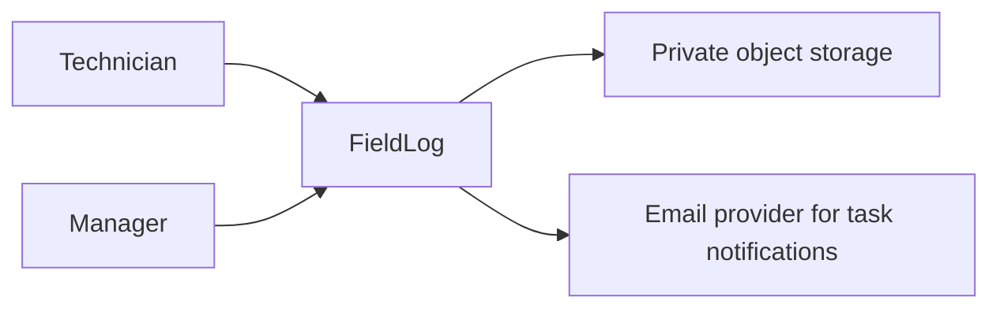
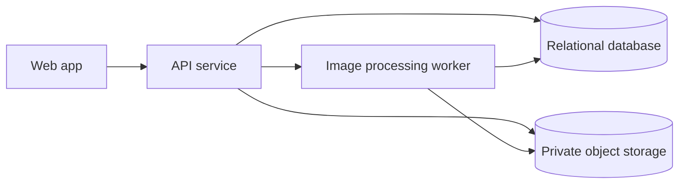

# FieldLog Architecture

## Purpose

Define the focused architecture for job notes, photo storage, and manager follow-up tasks.

## Status

Draft; AI-recommended default for architecture shape; Standard-backed for C4-style separation.

## Inputs used

- `product/02-prd.md`
- `auditability/decision-log.md`
- Assumed launch scale from `README.md`

## Sources and basis

- Standard-backed: C4 Model for context and container views.
- AI-recommended default: relational database for job notes and task status because the workflow has structured ownership and review states.

## Assumptions

| Assumption ID | Source type | Assumption | Impact |
| --- | --- | --- | --- |
| ASM-FL-003 | Assumption | A single web application and API service is enough for first release traffic. | If false, split background upload processing before launch. |

## Decisions

Architecture decisions are recorded in `auditability/decision-log.md`.

## Open questions

| Question ID | Question | Impact |
| --- | --- | --- |
| OQ-FL-003 | Is object storage already chosen by the hosting provider? | If yes, update object-store API details and security tests. |

## Traceability

`REQ-FL-001`, `REQ-FL-002`, `REQ-FL-003`, `RISK-FL-001`, and `TASK-FL-003` depend on this architecture.

## Architecture summary

FieldLog uses a browser client, API service, relational database, object storage, and background image-processing job. The database is the authority for job notes, task status, tenant ownership, and attachment metadata. Object storage holds binary images but never owns product state.

## Goals and constraints

- Keep job-note and task status authority in one relational data model.
- Keep photos private by default.
- Avoid direct browser writes to object storage until upload intent and tenant ownership are persisted.

## Architecture principles

- Product status is database-owned.
- Object storage is binary storage, not workflow truth.
- API authorization is checked against tenant membership on every object-scoped request.

## Future capability map

No post-MVP capability is approved. Offline sync, billing, and dispatch scheduling are explicit non-goals rather than hidden future commitments. If one becomes approved, the architecture pass must map it to the existing tenant identity, job-note authority, task workflow, artifact metadata, API contracts, and event consumers before implementation.

| Future capability / phase | Existing authority extended | Seam decision | Current consumer proof | Forbidden parallel authority | Activation trigger |
| --- | --- | --- | --- | --- | --- |
| None approved | Not applicable | Keep current implementation concrete; do not add a plugin framework or unused provider interface | Current note/photo/task flows exercise only the boundaries below | A speculative second workflow or storage metadata owner | A user-approved roadmap capability with a real contract |

## Evolution and extension strategy

The first release remains a modular monolith organized around job notes, follow-up tasks, and attachments. The API service owns domain commands; the relational database owns product state; object storage implements the binary-artifact boundary. The current upload flow exercises that storage boundary end to end. No additional seam is planted without an approved consumer, an expensive retrofit risk, a stable domain contract, and a current liveness path. A later feature must extend the named authority or record a migration ADR; it may not create a sibling note, task, membership, or attachment state model.

The killer mutation for the current boundary is allowing the browser or object store to mark an attachment available without the database-owned verification transition; the integration test must fail. The counterexample is the unapproved email provider: no generic notification bus is created now because no approved second notification consumer exists.

## C4 context diagram

## C4 container diagram

## Component map

| Component | Responsibility | Authority |
| --- | --- | --- |
| Web app | Job-note form, manager queue, task actions | No product truth |
| API service | Auth, validation, persistence, signed upload/download URLs | Request authority |
| Relational database | Job notes, task status, tenants, attachment metadata | Product truth |
| Object storage | Photo bytes | Binary storage only |

## Runtime flows

1. Technician creates job note draft in web app.
2. API persists note and attachment intent.
3. API issues scoped upload URL.
4. Worker verifies uploaded object and marks attachment available.
5. Manager creates follow-up task from submitted note.

## Deployment view

First release can deploy as one web app, one API service, one worker process, relational database, and object store.

## Environment model

Local, staging, and production must use separate databases and object buckets. Production secrets must not be copied into local test fixtures.

## Dependency map

- Web app depends on API contract.
- API depends on database migrations and object-store credentials.
- Worker depends on object-store event or polling mechanism.

## Failure modes

| Failure | User-visible behavior | Verification method |
| --- | --- | --- |
| Photo upload fails | Note remains saved with failed attachment state | Browser and API failure test |
| Worker delayed | Attachment shows pending state | Worker retry test |
| Manager lacks tenant access | Permission denied without note details | Authorization test |

## Performance budgets

- Job-note submit without photos: under 800 ms server response at p95 for first release target.
- Photo upload processing: attachment availability within 60 seconds for normal images.

## Scalability assumptions

`ASM-FL-001` limits first release expectations. Revisit architecture if the app moves beyond one regional service company.

## Security-relevant architecture choices

`RISK-FL-001` is handled by persisted upload intent, tenant-scoped object keys, short-lived signed URLs, and authorization checks before URL issuance.

## Blast radius overview

Changes to attachment metadata touch API upload routes, database schema, worker verification, manager review UI, and object storage policy.

## Tradeoffs

Direct browser uploads reduce API bandwidth but require stricter upload-intent authority. Keeping binary storage separate avoids database bloat but adds pending and failed attachment states.
