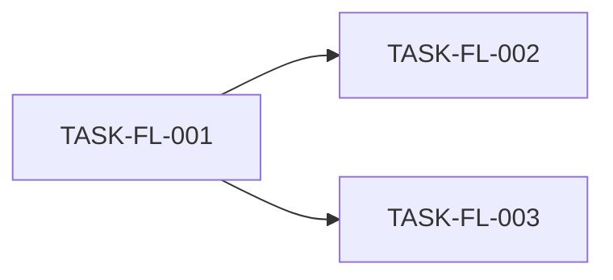

# FieldLog AI Implementation Task Plan

## Purpose

Break the focused FieldLog plan into agent-safe implementation slices with traceable requirements, risks, tests, docs updates, and rollback.

## Status

Draft; AI-recommended default task graph based on the PRD and architecture.

## Inputs used

- `product/02-prd.md`
- `architecture/06-architecture.md`
- `auditability/decision-log.md`

## Sources and basis

- Repo evidence: none; this is greenfield.
- AI-recommended default: vertical slices should start with authoritative data model and API contract before UI polish.

## Assumptions

| Assumption ID | Source type | Assumption | Impact |
| --- | --- | --- | --- |
| ASM-FL-004 | Assumption | The first implementation agent can choose framework-specific file names after repo creation. | If false, task contracts need concrete paths before coding. |

## Decisions

Task sequencing decisions are linked from `auditability/decision-log.md`.

## Open questions

| Question ID | Question | Impact |
| --- | --- | --- |
| OQ-FL-004 | Which auth provider will be used? | Affects role-check helper names and smoke setup. |

## Traceability

Each task maps to requirement IDs, risk IDs, verification, documentation update, and rollback or containment.

## Implementation principles

- Build source-of-truth data and API contracts before UI screens.
- Keep tenant ownership checks next to object-scoped API actions.
- Add tests in the same task that introduces the behavior.

## Vertical slice map

| Task ID | Requirement ID | Risk ID | Slice | Verification | Documentation update | Rollback or containment |
| --- | --- | --- | --- | --- | --- | --- |
| TASK-FL-001 | REQ-FL-001 | RISK-FL-002 | Job note model and create API | API contract test | Update `08-data-model-and-data-contracts.md` when full package exists | Disable create route behind feature flag |
| TASK-FL-002 | REQ-FL-002 | RISK-FL-002 | Follow-up task model and manager action | Role integration test | Update `product/02-prd.md` acceptance matrix | Hide manager action until status authority passes tests |
| TASK-FL-003 | REQ-FL-003 | RISK-FL-001 | Upload intent and private photo retrieval | Object authorization test | Update `architecture/06-architecture.md` attachment flow | Disable photo upload while preserving text notes |

## Task dependency graph



## Task contract template

Every future task prompt must include:

- Requirement ID.
- Risk ID.
- Files or modules owned by the task.
- Tests to run.
- Docs to update.
- Rollback or containment path.

## Feature slice tasks

See the vertical slice map.

## High-risk task gates

`TASK-FL-003` cannot ship until object authorization tests prove a manager cannot fetch photos outside the tenant.

## Future consumer and foundation seam map

No later capability is approved. Current tasks keep the job-note, task, tenant-membership, and attachment authorities concrete. `TASK-FL-003` extends the existing attachment metadata authority and proves it through upload-intent → object verification → manager retrieval; it may not create object-store-owned workflow state. Killer mutation: mark the attachment available from a storage callback without the owning domain transition; the integration test must fail. Offline sync, billing, and dispatch remain document-only non-goals until user approval and verified contracts reopen the seam audit.

## Root-cause and decision-depth gates

If status diverges across technician and manager views, audit the task authority model before patching display labels.

## Protected files and components

Auth middleware, tenant policy helpers, migrations, object storage policy, and signed URL helper code require review.

## Required tests per task

Each task has a listed verification method. Browser smoke is required when a user-facing workflow is added.

## Required docs updates per task

Docs updates are listed in the vertical slice map and must be completed before closing the task.

## Rollback or containment per task

Rollback or containment is listed in the vertical slice map and must avoid data loss.

## Codex prompt templates

```text
Implement TASK-FL-003. Preserve tenant-scoped upload intent as the source of truth. Run object authorization tests and update the architecture attachment flow.
```

## Do-not-build-yet list

- Offline sync.
- Billing integration.
- Dispatch scheduling.

## Assumptions blocking implementation

`OQ-FL-004` blocks final auth-provider-specific smoke tests.

## Requirement impact map

| Requirement ID | Task ID | Test |
| --- | --- | --- |
| REQ-FL-001 | TASK-FL-001 | API contract test |
| REQ-FL-002 | TASK-FL-002 | Role integration test |
| REQ-FL-003 | TASK-FL-003 | Object authorization test |
