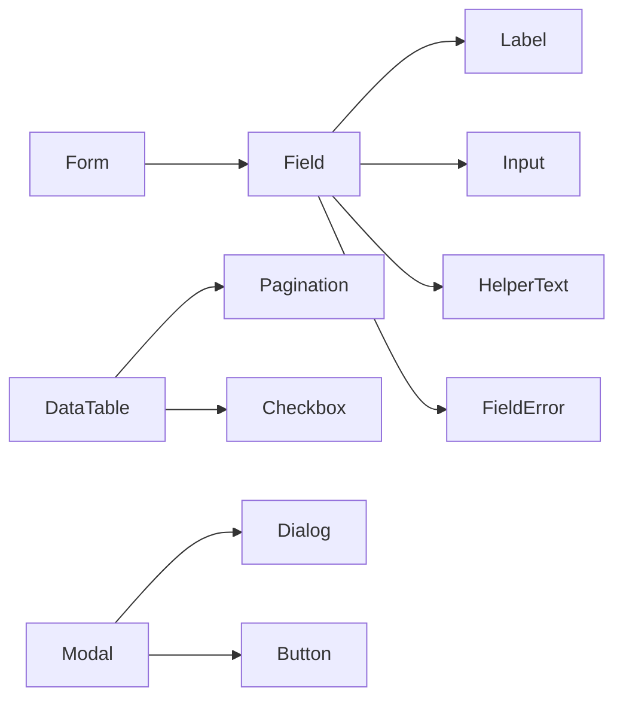

# Component System

Shared references at `../_visualforge-shared/references/`. Use them when needed.

## Global quality rules

- Read `anti-slop-design-rubric.md`, `design-decision-quality-protocol.md`, `token-artifact-export-spec.md`.
- Use `opinionated-decision-template.md`.
- Every component has: name, purpose, slots, props/variants, every state, bound tokens (no raw values), accessibility contract, animation behavior, responsive behavior, and a usage rule.
- Every state of every interactive component is specified: default, hover, focus-visible, focus-within, active/pressed, disabled, loading, error, success, selected, dragging, drop-target, indeterminate (where applicable), readonly.
- No component is described in prose alone — props and states are tables.
- Maintain `decision-log.md`.

## Purpose

Lock the component vocabulary. Every screen assembles components; every component is composed of tokens. This is the most detail-heavy subskill — components are where micro-decisions live.

## Mode-aware behavior

- **Greenfield / Specforge-enhanced:** Build inventory from UX flows + screen specs. Decide library adopt/extend/replace per component.
- **Retrofit:** Inventory existing components; produce ideal; drift entry for each component.

## Required research pass

```text
Research current component patterns for the chosen library (Shadcn / Radix / Material 3 / Fluent 2 / Ant 5 / etc.) as of 2026. Identify: which components exist, which need extension for our use, which need custom builds. Confirm accessibility patterns from WAI-ARIA Authoring Practices (https://www.w3.org/WAI/ARIA/apg/patterns/). Capture sources.
```

## Inputs

- Design brief — component library preference.
- Design tokens — all token paths.
- Surface treatments — recipes per surface category.
- Iconography — semantic icon map.
- UX flows — every screen's component needs.

## Output files

- `docs/design-system/05-components/overview.md` — narrative: library adopt/extend/replace policy, naming rules, composition rules, anti-patterns.
- `docs/design-system/05-components/_index.md` — full inventory + dependency graph (Mermaid).
- `docs/design-system/05-components/primitives/[ComponentName].md` — one file per primitive (Button, Input, Checkbox, Radio, Switch, Slider, Label, Avatar, Badge, Tag, Tooltip, Spinner, etc.).
- `docs/design-system/05-components/composites/[ComponentName].md` — one file per composite (Card, Dialog, Drawer, AlertDialog, Popover, Menu, Tabs, Accordion, Command, Toast, etc.).
- `docs/design-system/05-components/patterns/[ComponentName].md` — one file per pattern (TopBar, SideBar, Footer, DataTable, FilterBar, EmptyState, SearchResults, AvatarStack, ChartCard wrapper, etc.).
- `docs/design-system/05-components/domain/[ComponentName].md` — product-specific composites that don't generalize.
- Decision-log entries (DEC-410 to DEC-549, overflow DEC-550 to DEC-569) per `../_visualforge-shared/references/decision-id-allocation.md`. Components fill a wide range; if 549 is reached, use overflow before requesting more.

### File-organization rules

- Never put more than one component in one file.
- The category subdirectory (primitives / composites / patterns / domain) is determined by composition depth: primitives compose tokens only, composites compose primitives, patterns compose composites and define page-level chrome, domain composes anything but is product-specific.
- Cross-reference between components uses relative paths inside `05-components/`.

## Component inventory — minimum coverage

### Primitives
- Button (primary, secondary, ghost, destructive, link variants; sizes xs/sm/md/lg; icon-only; loading; with icon).
- IconButton.
- Input (text, email, password, search, number, tel, url; with prefix/suffix; with addon button).
- Textarea (with auto-resize variant).
- Select (native and custom-styled).
- Combobox (search + select).
- Checkbox (with indeterminate state).
- Radio (group).
- Switch / Toggle.
- Slider (single and range).
- DatePicker / DateRangePicker.
- TimePicker.
- ColorPicker (if applicable).
- FileUpload (drag-and-drop + button).
- Label.
- HelperText.
- FieldError.
- Form (wrapper with validation patterns).
- Link (in-text and standalone).
- Avatar (single, grouped/stack, with fallback initials, with status indicator).
- Badge (count, status, dot).
- Tag / Chip (closable, selectable).
- Tooltip.
- Popover.
- DropdownMenu / Menu.
- ContextMenu.
- Tabs (top, side, segmented).
- Accordion (single, multi).
- Collapsible.
- Card (default, interactive, media-led).
- Surface (generic elevated container).
- Divider (horizontal, vertical, with label).
- Separator (semantic divider for accessibility).
- Skeleton.
- Spinner / Loader.
- ProgressBar (determinate, indeterminate).
- ProgressCircle (determinate, indeterminate).
- Alert / Banner (info, success, warning, danger; closable).
- Toast / Snackbar (with action; with promise lifecycle).
- Dialog / Modal (default, alert/confirm, sheet/drawer for mobile).
- Drawer / Sheet (side, bottom).
- AlertDialog (destructive confirmation pattern).
- Command (palette).
- Breadcrumb.
- Pagination.
- EmptyState.
- ErrorBoundary fallback.
- Image (with placeholder, with blur-up, with aspect-ratio lock).
- VideoPlayer (if media).
- Code / CodeBlock (with copy, with language highlight, with line numbers).
- Kbd (keyboard key visual).

### Patterns / composites
- Header / TopNav.
- Sidebar / SideNav.
- Footer.
- DataTable (sortable, filterable, paginated, selectable rows, expandable rows, sticky header, column visibility).
- DataGrid (editable, virtualized for large data).
- Pricing card (if marketing).
- Feature card.
- Stat card / KPI card.
- ChartCard wrapper.
- Comment / Reply (if social).
- AvatarStack with overflow.
- FilterBar.
- SearchResults (with empty, no-results, with grouped results).
- **PricingPage** — for products that sell. Plan comparison table (or tile grid) with: plan name, price (toggle monthly / annual), key features, primary CTA, FAQ, trust signals (money-back, easy cancel, customer logos), currency-aware pricing. Loading / error / promo states. Decision card defines how many plans, which plan is "recommended," and whether enterprise tier surfaces "contact sales." Pricing must be honest — no fake-anchor, no opt-out-only trial.
- **BillingDashboard** — for products with paid plans. Current plan summary, usage vs limit, billing history (invoice list), payment method, billing contact, plan-change CTA, cancellation path (must not be harder than signup — required by FTC click-to-cancel guidance for subscription products). Invoice detail screen with downloadable PDF (`imagery-illustration.md` print rules apply).
- **InvoiceReceipt** — PDF-rendered receipt or invoice for a transaction. Branded header / footer, line items, totals, tax, payment method (masked), invoice number, dates, support contact. Accessibility: tagged PDF for regulated markets.
- **CheckoutForm** — for products that take payment. Stripe Elements / Adyen / native equivalent. PCI-conscious — never log card details client-side; iframe-isolation for card fields. Express checkout buttons (Apple Pay / Google Pay / PayPal / Link) above form. Address auto-complete. Currency-aware. Failed-payment recovery flow.
- **SettingsLayout** — the canonical settings architecture pattern. Two-pane (section nav + form pane) on desktop, collapsible nav to top-tabs on tablet, accordion or full-page navigation on mobile. Settings are grouped by scope (Account → user-scoped; Workspace → workspace-scoped; Billing → workspace-scoped; Integrations → workspace-scoped; Preferences → user-scoped). Each setting card uses the SettingRow pattern: label, current value, control, helper text, save state. Settings cannot exceed two levels of nesting; if they would, split into separate sections in the nav rather than nesting deeper.
- **HelpLayout / DocsLayout** — for in-product documentation, changelog, help pages. Three-pane (left nav + content + right TOC) on desktop, collapsing to single-pane with bottom-anchored nav on mobile. Search-first entry. Content uses prose-optimized typography from `02-visual-language/`.
- **ChangelogEntry** — versioned change announcement with category (Added / Changed / Fixed / Deprecated / Removed / Security), date, audience scope.
- **WhatsNewToast / Banner** — one-time announcement of newly-shipped features, dismissible, persisted-per-user.
- **EmbedPreview / OpenGraphCard** — how the product appears when shared. Image, title, description, fallback for image-load-fail.

### Domain-specific
- (Anything specific to the product domain that doesn't fit a generic pattern.)

## Per-component spec template

```markdown
## COMP-NNN — [ComponentName]

**Decision card:** DEC-NNN — Adopt | Extend | Replace [library component] | Build custom.

### Purpose
[One sentence: what this component is for and when to use it.]

### Library mapping
- **Library source:** [library name + component name + version] | Custom.
- **Adoption mode:** Use as-is | Wrap and re-export | Style-extend | Replace entirely.
- **Why this mode:** [one reason].

### Variants
| Variant | Use case |
|---|---|
| primary | Main CTA |
| secondary | Lower-emphasis action |
| ghost | Tertiary; inline contexts |
| destructive | Confirmed destructive action |
| link | In-flow links styled as buttons |

### Sizes
| Size token | Height | Padding | Type token | Icon size |
|---|---|---|---|---|
| xs | 24 | space.2 / space.2 | type.xs | icon.xs |
| sm | 32 | space.2 / space.3 | type.sm | icon.sm |
| md | 40 | space.3 / space.4 | type.base | icon.sm |
| lg | 48 | space.4 / space.5 | type.md | icon.md |

### Slots
- start-icon
- label
- end-icon
- loading-indicator (replaces start-icon when loading)

### Props
| Prop | Type | Default | Description |
|---|---|---|---|
| variant | "primary" \| ... | "primary" | ... |
| size | "xs" \| "sm" \| "md" \| "lg" | "md" | ... |
| loading | boolean | false | replaces icon with spinner, disables interaction |
| disabled | boolean | false | non-interactive, dimmed |
| iconOnly | boolean | false | square aspect, aria-label required |
| fullWidth | boolean | false | stretches to parent width |
| as | ElementType | "button" | render-as for link composition |

### States and bound tokens

| State | bg | fg | border | shadow | transform | tokens used |
|---|---|---|---|---|---|---|
| rest | `button.primary.bg.rest` | `button.primary.fg` | none | `shadow.button.rest` | none | ... |
| hover | `button.primary.bg.hover` | `button.primary.fg` | none | `shadow.button.hover` | translateY(-1px) | ... |
| focus-visible | (rest) | (rest) | 2px `border.focus` outside ring | (rest) | (rest) | ... |
| active | `button.primary.bg.active` | `button.primary.fg` | none | `shadow.button.active` | translateY(0) scale(0.98) | ... |
| disabled | `button.primary.bg.rest` opacity 40% | (faded) | none | none | none | ... |
| loading | (rest) | (rest) | none | (rest) | none | spinner replaces start-icon |

Every state references tokens by name. No raw values.

### Motion
- **Hover → rest:** transform + shadow, `duration.fast` `ease.standard`.
- **Active feedback:** scale 0.98 on press, returns on release.
- **Loading spinner:** continuous rotation, `duration.slower` linear infinite.
- **Reduced-motion:** all transforms and durations → 0 except spinner (replace with subtle opacity pulse).

### Accessibility contract
- **Role:** button (or appropriate semantic).
- **Keyboard:** Enter and Space trigger action. Tab focusable. Focus-visible style on keyboard focus only (not on click).
- **Screen reader:** label from text content or `aria-label` when iconOnly. Loading state announces "Loading" or busy state.
- **Touch target:** ≥ 44×44 effective area (sm and xs sizes need padding compensation).
- **Color contrast:** all variant rest/hover/active states verified against backgrounds.
- **Reduced motion:** honored.
- **Dark mode:** all tokens have dark variants.
- **High contrast:** add 1px border outline.

### Responsive behavior
- Fluid: respects fullWidth prop.
- Density: respects density mode (compact reduces height by one size step).

### Composition rules
- **Used inside:** Forms, Modals, TopBars, CTAs, EmptyStates.
- **Never inside:** other Buttons; instead, use Link variant.
- **Spacing with siblings:** `space.2` gap when adjacent.

### Anti-pattern
- Do not use destructive variant for non-destructive actions even if it visually fits.
- Do not stack three primaries; one primary per region.

### Token bindings (for tokens.json link)
- `button.primary.bg.rest`
- `button.primary.bg.hover`
- (full list)

### React-implementation contract (added v1.8.0 per VF-FIND-036 §17d)

For components that will ship to `src/components/` (or framework equivalent), the spec must additionally name:

- **Boundary:** server | client. Default to server; mark client only when the component needs browser state, effects, or event handlers.
- **State ownership:** which state this component owns (none | local | global). If global, name the store.
- **Data dependencies:** server fetch (which query / endpoint) | hook (which) | context (which) | none.
- **Suspense / streaming boundary:** does this component define one? (yes / no / wrapped by parent).
- **Error boundary:** does this component define one? (yes — fallback component | no — relies on parent).

This contract is consumed by `frontend-contract` §17d and the mutation log (per VF-FIND-024) — without it, wrapper-encapsulated semantic drift (VF-FIND-025) and effect-tangle regressions can slip through.

### Test expectations
- Storybook story per variant × size × state.
- Visual regression on rest / hover / focus / disabled.
- a11y test (axe-core) passes.
- Keyboard interaction test passes.
- Server/client boundary mutation: a test that fails if the boundary declaration is changed without updating the component (per `test-discipline-and-mutation-protocol.md`).
```

Produce this spec for every component in the inventory.

## Library adopt/extend/replace decision

For every component, decide:

- **Adopt as-is:** library component covers our needs.
- **Wrap and re-export:** library component but with our defaults and brand tokens applied.
- **Style-extend:** library primitive + heavy custom styling.
- **Replace entirely:** custom implementation (justify with library's gap).

Record decision per component. Default rule: prefer Wrap or Style-extend; Replace only when library is missing the component or has accessibility gaps.

## Component dependency graph

Some components compose others. Render a Mermaid graph:



This drives implementation order and prevents circular deps.

## Decision cards

- DEC-440 Library adopt/extend/replace strategy (top-level).
- DEC-450 Component inventory lock (the full list).
- DEC-460 Form composition pattern (Field-wrapped vs flat).
- DEC-470 Modal pattern (Dialog primitive + variants).
- DEC-480 DataTable adoption (TanStack Table / library / custom).
- DEC-490 Toast system (library or custom; queue limit; default duration).
- DEC-500 Tooltip vs Popover usage rules.
- DEC-510 Command palette adoption + content.
- One DEC per non-trivial component.

## Anti-slop component rules

- "Standard button component" without variants × sizes × states × tokens fails.
- A component with only a "default" state listed fails.
- A component without an accessibility contract fails.
- "Use shadcn for everything" without per-component decisions fails — every component has a decision.
- Hard-coded hex/px in a component spec fails.
- A component without a Storybook test expectation fails.

## Quality gate

- Full inventory listed.
- Every component has a per-component spec.
- Every spec has every state.
- Every state references tokens, not raw values.
- Every component has accessibility contract and motion behavior.
- Dependency graph rendered.
- Library adopt/extend/replace decision per component.

## Sources and basis

Per-component rationale tied to UX flows, library source, and accessibility patterns. WAI-ARIA APG referenced for interactive components.
