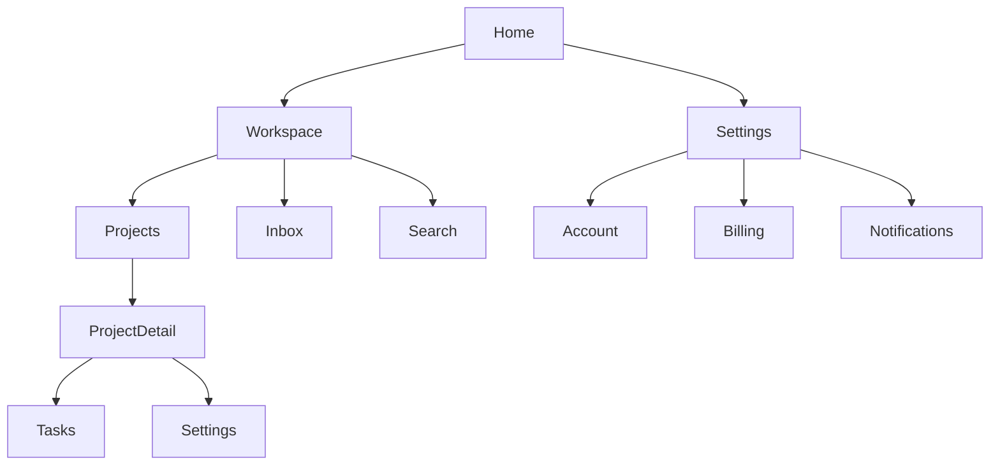

# Information Architecture

Shared references at `../_visualforge-shared/references/`. Use them when needed.

## Global quality rules

- Read `anti-slop-design-rubric.md`, `design-decision-quality-protocol.md`.
- Use `opinionated-decision-template.md`.
- Every nav element has a specific purpose, audience, frequency, and depth.
- Labels are user-words (from persona language map), not system-words.
- Maintain `decision-log.md`.

## Purpose

Decide how content and features are organized, navigated, named, and reached. IA constrains every screen design and every URL. Bad IA means users get lost; good IA is invisible.

## Mode-aware behavior

- **Greenfield:** Build IA from feature scope + personas + mental-model map.
- **Specforge-enhanced:** Use Specforge feature scope as the inventory; design IA over it.
- **Retrofit:** Run the full IA restructuring pass (see Retrofit IA section below). Inventory existing routes, analyze page-by-page, surface splits / merges / missing / misplaced / orphan / dead-end / role-leak findings, triage with the user, then produce ideal IA. Drift entry covers route migrations and structural changes.

## Retrofit IA pass

In retrofit mode, **before** producing ideal IA, run `../_visualforge-shared/references/ia-restructuring-protocol.md`:

1. Confirm `data-inventory.md` exists (UX flows / orchestrator runs the data inventory protocol first).
2. For every existing page identified in `retrofit/inventory.md`, capture role(s) served, task(s) supported, top-level data displayed, components present, navigation depth, inbound and outbound links, cognitive load.
3. Surface findings in all seven categories:
   - **Splits:** pages mixing roles, task domains, or data scopes (canonical case: team stats + individual member data on one page → split into `/team/overview` and `/team/members`).
   - **Merges:** fragmented same-task pages and single-setting pages that should be sections.
   - **Missing pages:** account lifecycle, notification prefs, help / support, trust / legal, admin pages, error / system pages, auth flow completeness, onboarding, empty-state pivot pages, detail pages when only lists exist.
   - **Misplaced content** in the wrong nav section.
   - **Orphan pages** unlinked from main nav.
   - **Dead-end pages** with no next action.
   - **Permission / role leaks.**
4. Cross-reference findings against `data-inventory.md` and `missing-surfaces.md`: an entity in the data layer with no user-facing surface frequently indicates a missing page.
5. For each finding produce a card with rationale, proposal, routing migration, risk, reversal trigger.
6. Triage every finding with the user: accept / defer / reject. Record outcomes in `auditability/deferred-findings.md` and `auditability/rejected-findings.md`.
7. Accepted findings flow into the ideal IA and into `retrofit/migration-plan.md`.

Output: `docs/design-system/retrofit/ia-restructuring.md`.

## Output paths (organized, not flat)

- Narrative IA doc: `docs/design-system/03-structure/information-architecture.md`.
- Rendered site map: `docs/design-system/03-structure/site-map.md` (Mermaid + node annotations).
- Per-screen specs are written by `visualforge-ux-flows` to `docs/design-system/06-screens/SCR-NNN-[slug].md`. This subskill cross-references screen IDs only.
- Retrofit-only: `docs/design-system/retrofit/ia-restructuring.md`.

## Required research pass

Only when product domain conventions are unclear:

```text
Research IA conventions for [product category]. Identify primary navigation patterns (top-bar, side-rail, command palette, hybrid), depth conventions, common URL patterns, search behavior, breadcrumb conventions, and onboarding placement. Find 3 reference products and their nav maps.
```

## Inputs

- Feature scope (from Specforge `03-feature-scope.md` or user input).
- User personas + mental-model map.
- Competitive audit nav patterns.
- Brand identity (drives nav surface treatment in `surface-treatments`).

## Output files

- `docs/design-system/03-structure/information-architecture.md` — narrative IA, nav model decisions, taxonomy, search architecture, role-aware IA, mobile vs desktop mapping.
- `docs/design-system/03-structure/site-map.md` — rendered Mermaid tree with per-node annotations (label, route, persona, role, depth, frequency).
- `docs/design-system/retrofit/ia-restructuring.md` — retrofit mode only.
- `docs/design-system/auditability/deferred-findings.md` and `rejected-findings.md` — appended when user defers / rejects restructuring findings.
- Decision-log entries (DEC-225 to DEC-249, overflow DEC-250 to DEC-254) per `../_visualforge-shared/references/decision-id-allocation.md`.

## Sections

### 1. Navigation model decision

Pick one as primary; secondary patterns must be justified.

- **Top bar primary:** marketing / consumer / shallow IA.
- **Side rail primary:** content-tool / dashboard / multi-context.
- **Command palette primary:** power-user / keyboard-first (Linear, Raycast).
- **Tab bar (mobile primary):** mobile-app native.
- **Hybrid (top bar + side rail):** complex SaaS with both global and contextual nav.

Decision card lists the rejected alternatives.

### 2. Navigation hierarchy

For each nav zone, define:

- **Global nav:** top-level destinations, max 5–7. Each is a verb-or-noun phrase from the persona language map.
- **Local nav (per section):** sub-sections within a global destination.
- **Contextual nav:** in-content nav (e.g., document outline, tabs on detail pages).
- **Utility nav:** account, settings, help, notifications.
- **Footer nav:** legal, marketing-secondary, support.

### 3. Site map / app map

Render as Mermaid tree:



Every node must have:

- Node ID.
- Display label (user-words).
- URL pattern.
- Persona accessibility (which personas reach this).
- Frequency of access (per session estimate).
- Depth from root.

### 4. URL / route structure

For web products:

- **Pattern:** `/[workspace]/[section]/[item]/[sub]` or domain-specific.
- **Slugs vs IDs:** slugs for SEO-visible content, IDs for private.
- **Reserved paths:** `/api`, `/_internal`, etc.
- **Auth boundary:** which routes require auth.
- **404 / catch-all:** route + page treatment.
- **Localization:** path-prefix (`/en/`) or domain-prefix (`en.example.com`).
- **Pretty URL rules:** lowercase, hyphenated, no trailing slash (or trailing slash — pick one and lock).

For native apps:

- **Deep link scheme:** `app://workspace/projects/[id]`.
- **Universal links:** mapping web → app routes.

### 5. Taxonomy and labeling

For each major content type, define:

- **Singular and plural names:** "Project / Projects", "Task / Tasks".
- **Verb forms:** "Create project", "Archive project", "Restore project".
- **Synonyms rejected:** what users might call it that you do not (so search resolves to canonical).
- **Source of label:** persona language map, competitive convention, or user research.

### 6. Search architecture

If search is present:

- **Scope:** global / scoped per section / both with toggle.
- **Trigger:** `/`, Cmd+K, dedicated bar, magnifying glass icon.
- **Result types:** what kinds of objects appear.
- **Result ranking philosophy:** recency / relevance / weighted.
- **Empty state:** what shows before user types.
- **No-results state:** suggestions or empty illustration + CTA.
- **Filter integration:** in-search filters or post-search facets.

### 7. Command palette (if adopted)

- **Trigger:** Cmd+K / Ctrl+K (standard).
- **Result types:** actions, navigation, search, AI prompts.
- **Hierarchy:** flat or grouped sections.
- **Keyboard nav:** arrow keys, return to execute, escape to close, tab to switch tabs.
- **Recently used:** retention policy.

### 8. Onboarding placement

- **First-run flow:** modal sequence, embedded tutorial, or empty-state-led.
- **Empty-state-as-onboarding:** every empty state teaches the next action.
- **Help / tour entry:** persistent location.

### 9. Permissions and role-aware IA

For each user role:

- **Visible destinations:** which global nav items appear.
- **Visible actions:** which CTAs appear.
- **Permission-denied path:** where user lands if they try to access a forbidden route.

### 9-bis. Marketing site vs product app boundary

When a product has both a marketing site (public, conversion-focused) and a product app (authenticated, task-focused), the IA spans both. Decide explicitly:

- **Same domain or split?** `example.com` for marketing + `app.example.com` for product is the most common split. Alternative: same domain with `/app` path prefix for authenticated routes. Cookies / SSO must work either way.
- **Shared header / footer or different?** Marketing usually has marketing-tuned nav (Product / Pricing / Customers / Resources / Sign in / Get started). Product has product-tuned nav. They should *feel* like the same brand but they are different products.
- **Token coexistence:** marketing and product share Tier 1 primitives (brand color, type family) but can have different Tier 2 semantic values (marketing may use a warmer surface; product a flatter one). Same `tokens.json` source; different consumers via theme switch or build-time export.
- **Conversion handoff:** the moment a user goes from marketing to product (sign-up CTA) is a designed transition — what they see, what data carries, what's preserved.
- **Brand voice:** marketing voice is more persuasive; product voice is more functional. Same brand, different posture. Reference content-design tone variations.
- **Performance budgets differ:** marketing site optimized for LCP / SEO / share-link previews. Product app optimized for INP / interactivity. Different budgets, both within the brand's tolerance.
- **Tracking / analytics differ:** marketing tracks funnel + acquisition; product tracks engagement + retention. The data inventory must distinguish.

Document the marketing-product boundary in the IA doc with: domain decision, nav comparison, shared-vs-separate component / token decisions, transition design (sign-up handoff), brand voice posture per surface, and per-surface performance budget.

### 10. Mobile vs desktop IA

- **Are they the same?** (Equivalent / reduced / different.)
- **What collapses?** Side rail collapses to drawer on mobile? Top bar collapses to icon menu? Bottom tab bar replaces top nav?
- **Gesture nav:** swipe back, edge swipe, etc.

### 11. Mental model alignment

Cross-reference the persona mental-model map: do the labels and structure match the metaphors users reach for? If not, change the labels — not the user.

### 12. Decision cards

- DEC-225 Primary nav model.
- DEC-226 Global nav inventory.
- DEC-227 URL / route structure.
- DEC-228 Taxonomy lock.
- DEC-229 Search architecture (or rejection).
- DEC-230 Command palette adoption (or rejection).
- DEC-231 Onboarding placement.
- DEC-232 Role-aware IA rules.
- DEC-233 Mobile vs desktop IA mapping.

## Session-state edge case map (v1.1 — per VF-FIND-009)

Required section in every IA output. For every route in the IA, document behavior when system state changes from outside the user's action:

### Required cases

For each interactive route, enumerate the behavior for at least these eight cases:

1. **Session expired mid-action** — user is mid-task when the auth session expires. Pattern: in-context re-auth modal preserving form state; fallback to redirect-to-`/sign-in` with return URL for unsaved state.
2. **Role revoked mid-session** — user's workspace role is downgraded or they're removed entirely while signed in. Pattern: next protected action returns 403; banner offers "Refresh" or "Sign in to different account."
3. **Resource deleted mid-session** — user has a deep link or in-memory reference to a record that was deleted. Pattern: 404 with "this [resource] was deleted on [date] by [actor]" + restore-from-trash affordance if applicable.
4. **Resource archived mid-session** — soft-deleted records remain accessible read-only. Pattern: full page with `[Archived]` banner; CTAs disabled; "Restore" prominent for authorized roles.
5. **Multi-tab session conflict** — user signs out on Tab B; Tab A still holds an authenticated UI. Pattern: Tab A's next mutation triggers re-auth; idle Tab A receives a `BroadcastChannel` ("session ended elsewhere") signal that surfaces a non-blocking banner.
6. **Token-gated link expired** — invite, password-reset, magic-link, verify-email tokens that have expired or already been used. Pattern: explicit error page with recovery action ("Request a new invite" / "Send a new reset link" / etc.). Never a generic 404.
7. **Rate-limited mid-action** — 429 returned by API mid-task. Pattern: surface "You're going fast — try again in N seconds" with countdown; preserve form state.
8. **Plan-state change mid-session** — plan downgraded, free-trial expired, payment failed, suspended. Pattern: feature lockout with "Your workspace is on [plan]. [Action] requires [higher plan]." Read-only mode where feasible; never silent feature removal.

### Required output

A table or per-route block in `03-structure/information-architecture.md` showing the eight cases against each top-level route. For routes where a case is n/a (e.g., `/sign-in` doesn't have a "session expired" case because it's the destination of that case), mark explicitly as `n/a` with reason.

### Cross-reference

The pressure-test subskill's Pass D (failure modes) cross-references this map. Any failure mode in Pass D not already documented here is a finding — surface to the orchestrator for IA revision.

## Anti-slop IA rules

- "Intuitive navigation" fails.
- "Easy to find" fails.
- IA designed from feature list instead of user task is a common slop pattern — start from persona tasks.
- Nav with > 7 top-level items is almost always over-flat IA; consider sub-grouping.
- Nav with < 3 items is almost always under-decided; consider what's missing.
- Hamburger menu on desktop is a slop default; prefer surface-level nav unless mobile-first.
- IA without a session-state edge case map fails per VF-FIND-009.

## Quality gate

- Primary nav model decided with alternatives rejected.
- Full site map rendered with all nodes annotated.
- URL structure locked.
- Taxonomy table covers all major content types.
- Search and command-palette decisions made (adopt or reject).
- Role-aware IA documented for every role.
- Mobile vs desktop IA mapping done.
- **Session-state edge case map produced** (v1.1 — VF-FIND-009). Every top-level route has documented behavior for the 8 required cases (or explicit `n/a` with reason).

## Sources and basis

Per-decision rationale tied to personas, competitive audit, mental-model map, and platform conventions.
