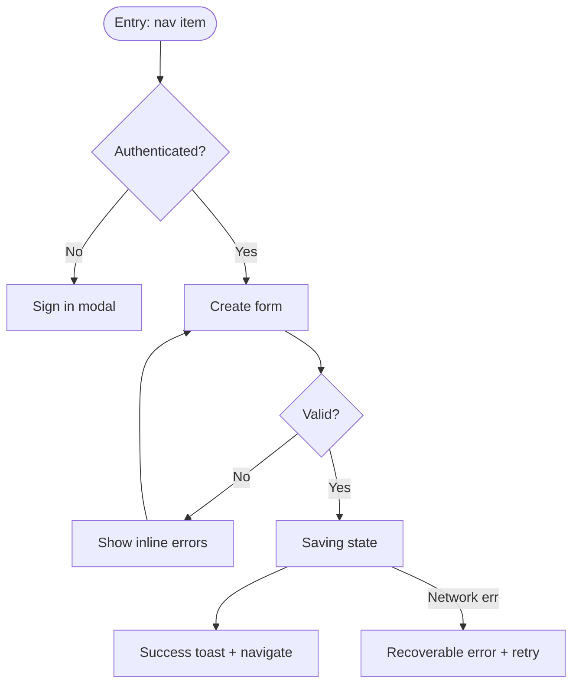

# UX Flows and Screen Specs

Shared references at `../_visualforge-shared/references/`. Use them when needed.

## Global quality rules

- Read `anti-slop-design-rubric.md`, `design-decision-quality-protocol.md`.
- Use `opinionated-decision-template.md`.
- Every flow has a persona, a starting context, an end state, and every intermediate decision point.
- Every screen has every state — never just the happy path.
- Wireframes are structural, not visual — they specify slots and content, not colors and fonts.
- Maintain `decision-log.md`.

## Purpose

Make every user task visible end-to-end before component design. Flows reveal missing screens, missing states, and contradictions between IA and personas.

## Mode-aware behavior

- **Greenfield:** Generate journey maps and task flows from personas + feature scope + IA.
- **Specforge-enhanced:** Same as greenfield; if Specforge has data contracts at `docs/app-plan/data/`, read them as the data inventory.
- **Retrofit:**
  1. Run `../_visualforge-shared/references/data-inventory-protocol.md` first. Produce `retrofit/data-inventory.md`, `retrofit/data-crosswalk.md`, `retrofit/backend-gaps.md`, `retrofit/missing-surfaces.md`.
  2. Confirm IA restructuring findings from `retrofit/ia-restructuring.md` have been triaged.
  3. Inventory existing flows and screens.
  4. Produce ideal flows + screen specs anchored to the data inventory.
  5. Drift entry per changed flow / screen.

## Data inventory before screen specs (retrofit + specforge-enhanced)

Before writing any screen spec in retrofit or specforge-enhanced mode:

- Read every entity and every field from the data inventory.
- For every screen spec, the **Data displayed** section references specific entity.field paths from the inventory (e.g., `User.email`, `Team.member_count`).
- For any field the design needs that does not exist in the inventory, write a `BackendGap` entry to `retrofit/backend-gaps.md` and either remove from spec or mark `placeholder` with the gap reference.
- For any entity in the inventory that no screen surfaces, the orchestrator surfaces a `MissingSurface` finding (see `data-inventory-protocol.md`).

This prevents two failure modes simultaneously: designs that invent fields, and designs that miss important data the backend already produces.

## Required research pass

```text
Research current UX flow conventions for [product category]: onboarding patterns, sign-up flows, primary task completion patterns, search-to-result flows, error-recovery flows, empty-state-to-first-success flows. Identify 3 reference products and their flow shapes. Capture sources.
```

## Inputs

- Personas (`02-user-personas.md`).
- IA (`09-information-architecture.md`).
- Feature scope (Specforge `03-feature-scope.md` or user input).
- Layout pattern library (`10-layout-system.md`).

## Output files

- `docs/design-system/04-interaction/ux-flows.md` — narrative: journey maps per persona, task flow inventory, critical-path flow narrations, empty-state and error philosophies, onboarding flow spec. Per-flow Mermaid diagrams embedded.
- `docs/design-system/06-screens/_index.md` — screen inventory table (every screen × route × layout pattern × personas × auth × data entities surfaced).
- `docs/design-system/06-screens/SCR-NNN-[slug].md` — one file per screen with full wireframe spec, every state, keyboard shortcuts, analytics events, and an explicit `Data displayed` block referencing the data inventory (retrofit mode) or planned data shape (greenfield).
- Retrofit-only outputs (produced by the data-inventory step within this subskill):
  - `docs/design-system/retrofit/data-inventory.md`
  - `docs/design-system/retrofit/data-crosswalk.md`
  - `docs/design-system/retrofit/backend-gaps.md`
  - `docs/design-system/retrofit/missing-surfaces.md`
- Decision-log entries (DEC-340 to DEC-399, overflow DEC-400 to DEC-409) per `../_visualforge-shared/references/decision-id-allocation.md`.

## Sections

### 1. Journey maps (per persona)

For each persona, produce a journey map covering their primary product usage. Stages typically: Awareness → First-run → First success → Habit → Mastery → Advocacy or Churn.

Per stage, document:

- **Persona state of mind:** what they're feeling, what they want.
- **Product touchpoint:** which surface they're on.
- **Friction risks:** specific failure modes.
- **Success signal:** what tells us this stage completed.

### 2. Task flow inventory

For every persona's primary tasks, produce a task flow. Examples (varies by product):

- Sign up / sign in.
- Onboarding to first action.
- Create primary entity (project, document, post, item).
- Edit and save.
- Share / invite collaborator.
- Search and find.
- Filter and narrow.
- Bulk action.
- Destructive action with confirmation.
- Recover from error.
- Manage account / billing.

For each task flow:



Document for each task:

- Persona.
- Entry points (multiple).
- Happy path.
- Error paths.
- Empty-state path (if applicable).
- Permission-denied path.
- Offline / degraded path (if applicable).
- Cancellation path.
- End state.
- Telemetry events emitted (link to analytics if Specforge defines them).

### 3. Screen inventory

A complete list of every screen in the product, with route, layout pattern, persona, and component slot map.

| Screen ID | Name | Route | Layout pattern | Personas | Auth required |
|---|---|---|---|---|---|
| SCR-001 | Home | `/` | Marketing | Visitor | No |
| SCR-002 | Workspace | `/[ws]` | Dashboard | Owner, Member | Yes |
| ... | ... | ... | ... | ... | ... |

### 4. Per-screen wireframe spec

For every screen in the inventory, produce a wireframe spec (not visual design — structural):

```markdown
## SCR-NNN — [Screen name]

- **Route:** `/[pattern]`
- **Layout pattern:** [from layout pattern library]
- **Personas reaching this screen:** [list]
- **Auth required:** yes/no; if yes, what roles
- **Primary action:** [one sentence]
- **Secondary actions:** [list]
- **Data displayed:**
  - [data point 1 + source]
  - [data point 2 + source]
- **Data submitted (if form):**
  - [field 1 + validation rules]
  - [field 2 + validation rules]

### Layout slot map
- header: title, action button
- filter rail: [filters]
- main: [primary content]
- footer: [pagination / footer actions]

### States
- **Default:** [description]
- **Loading:** [skeleton placement, what shows during fetch]
- **Empty (no data yet):** [illustration / icon / message + primary CTA]
- **Empty (filter excluded all):** [different message: "Adjust filters" + secondary action]
- **Partial-load:** [pagination / infinite-scroll behavior]
- **Error (server):** [recoverable error message + retry]
- **Error (network offline):** [offline state, cached content if any, retry on reconnect]
- **Permission denied:** [explanation + escalation path]
- **Success after action:** [confirmation pattern]
- **Disabled (read-only):** [visual indicator + explanation]

### Keyboard shortcuts
- [list]

### Analytics events (if Specforge defines)
- [event 1 with payload]
- [event 2]

### Out-of-scope behavior
- [explicitly not done on this screen]
```

### 5. State coverage matrix

For each interactive screen, verify every state is specified:

| Screen | Default | Loading | Empty (initial) | Empty (filtered) | Error (server) | Error (network) | Permission | Success | Disabled |
|---|---|---|---|---|---|---|---|---|---|
| SCR-002 | ✓ | ✓ | ✓ | ✓ | ✓ | ✓ | ✓ | ✓ | n/a |

Gaps in this matrix block completion.

### 6. Critical-path flows

Identify the top 5 critical-path flows for the product (the ones where success or failure determines product adoption). For each, produce an extended spec including:

- Step-by-step screen-by-screen narration.
- Decision points and branching.
- Hidden states (validation pending, optimistic updates).
- Recovery patterns.
- Acceptance criteria for the entire flow.

### 7. Empty-state philosophy

Decide for the product:

- **Empty as opportunity:** illustration + CTA that teaches the next action.
- **Empty as minimal:** plain text + small CTA.
- **Empty as transparent:** show structure with placeholder rows.

Apply consistently across screens.

### 8. Error messaging philosophy

Pair with `content-design`. Decide:

- Tone (sober regardless of brand warmth, or warm-direct).
- Structure (what happened + why if known + what to try).
- Recovery affordance (retry button always, contact-support secondary).
- Internal-detail policy (never expose stack traces, error codes acceptable when actionable).

### 9. Onboarding flow

Specific spec for first-run experience:

- Welcome modal or empty-state-led.
- Number of steps (max 3 for soft, 5 for required).
- Skippable or required.
- Persistence (resumable if abandoned).
- First-success moment defined.

### 9a. Lifecycle stages (beyond onboarding)

Most products treat lifecycle as "onboarding then done." Real lifecycle has stages, each with its own design needs.

For each persona, design for these lifecycle stages:

- **Day 0 — First run:** onboarding, first success.
- **Day 1–7 — Activation:** habit formation, second-action prompts, feature discovery surfaces.
- **Day 8–30 — Engagement:** deeper feature surfaces, ramp-up, mastery cues, advanced features unveiled.
- **Day 31–90 — Habit:** product is part of routine; design supports speed and confidence; subtle surface for new features without disrupting.
- **Day 90+ — Mastery / advocacy:** power-user features surface, referral / sharing prompts when earned, community / advanced docs accessible.
- **Dormant (no activity 14+ days):** re-engagement design — what triggers, what surfaces on return, "you've been away" handling without guilt-tripping.
- **Returning after long gap (3+ months):** re-onboarding-lite — what changed since they were away (changelog summary), did data persist, are saved preferences still relevant.
- **Churn risk:** signals (declining usage, cancel-page visit) and design responses (in-app message, support reach-out, save-flow design).
- **Departure:** account deletion, data export — covered in auth-flows but the *experience* of leaving must respect the user (no manipulative cancel flows; quick, dignified).

For each stage produce: what the user sees, what's surfaced, what's hidden, what changes from the previous stage.

### 9b. Moments of truth

For every product, identify 3–5 **moments of truth** — moments where the product must shine. Examples by product class:

- **Consumer product:** first-time wow, first share with friend, first achievement, first failure recovery.
- **Productivity tool:** first task saved, first collaboration invite, first complex output produced.
- **Marketplace:** first listing posted, first message received, first transaction, first dispute resolution.
- **AI tool:** first prompt that exceeds expectations, first multi-step task completed, first failed prompt handled well.
- **Health / habit:** first streak, first plateau, first relapse / recovery.

For each moment of truth, design:

- **What state precedes it.**
- **What the product does at the moment.** (Visual, motion, copy, sound if applicable.)
- **What the user feels.**
- **What follow-up the product provides** to reinforce the moment.
- **What happens if the moment fails** (e.g., AI prompt doesn't exceed expectations — graceful failure path).

### 9c. Trust formation moments

Trust is built or lost at specific moments. Inventory and design each:

- **First sign-up:** what data is asked, what isn't, why each field is needed (visible "Why we ask"), what happens after.
- **First payment / billing:** clear pricing, confirmation copy, easy reversal, receipt design.
- **First share / invite:** what gets shared, what doesn't, who can see what — privacy surface.
- **First content moderation interaction:** how the product responds when user encounters bad content or is themselves moderated.
- **First failure:** the product makes a mistake — does it own it, explain, and recover?
- **First sensitive operation:** delete, downgrade, cancel — does the product respect the user's choice or fight back?
- **First permission prompt:** push, location, camera — clearly explained, asked at the right moment (not at app start).
- **First data export / portability touch:** GDPR rights, easy export, no friction.

Each trust moment has a design contract.

### 9d. Service blueprint

For each primary user task, map the *backstage* — what the product does invisibly to make the experience work.

```markdown
### Service blueprint — [task]

| Stage | User action (frontstage) | UI response (frontstage visible) | System action (backstage invisible) | Support / human action (backstage) | Failure modes |
|---|---|---|---|---|---|
| Discover | scrolls feed | feed shimmer + load | recommendation API call | (none) | API slow → cached results |
| Select | taps item | item detail loads | analytics event, prefetch related | (none) | item deleted → 404 |
| Act | taps subscribe | optimistic UI + spinner | billing API + email send + audit log | webhook to CS notifying new sub | payment fails → recover |
| Confirm | sees success | success state + email | DB write + cache invalidation + reporting | (none) | DB lag → ensure UI source-of-truth correct |
| Use | uses feature | feature unlocked | usage tracked | CS proactive welcome | feature unavailable → fallback path |
| Renewal / churn | (passive) | upcoming-renewal notice | billing schedule + retry policy | CS retention outreach if churning | card fails → grace period + dunning |
```

The service blueprint reveals where design needs to set expectations for backstage operations (latency, success/failure communication, support escalation visibility).

### 9e. Interruption recovery

For every flow that has > 1 step, design recovery from interruption:

- **Save on every step:** autosave + visible "Saved" indicator.
- **Resumable URLs:** every step has a unique URL when sharing-link is useful.
- **Re-entry restoration:** user closes tab, returns later — pick up where they left, with explicit "Continue where you left off" CTA.
- **Cross-device resumption:** start on phone, finish on desktop (when meaningful).
- **Session expiry mid-flow:** preserve state across re-auth; reference auth-flows.
- **Network drop mid-action:** queue + sync; visible offline indicator + pending-actions badge.

### 9f. Frustration recovery (beyond errors)

When a user is genuinely stuck (not just an error — a comprehension or decision stuck):

- **Inline contextual help:** "?" tooltip with explanation, ideally linking to docs.
- **Search-in-place:** when user opens search, suggest "Looking for…?" common queries.
- **Smart defaults:** when user pauses on a form field, offer suggested values.
- **Escalation path:** "Contact support" is visible at the right moments (not buried).
- **Bail-out:** "I'll come back later" is always acceptable; never trap the user in a flow.

### 9g. Celebration / milestone moments

Pair with motion-design signature moments. For specific user milestones (first save, first share, 7-day streak, paid plan upgrade, year anniversary):

- **Acknowledge:** product notices.
- **Calibrated:** not over-the-top for everyone (no confetti on every action), not absent (cold product feels indifferent).
- **Optional:** user can dial down (in preferences) without disabling the product.
- **Authentic:** tied to actual value created, not vanity metric.

### 9h. Regret prevention

Beyond destructive confirmations (already in content-design):

- **Soft delete by default** for non-recoverable user content. Recovery window 30 days standard.
- **Undo trail in toast** for non-destructive actions (recently performed actions accessible from a "Recent" menu).
- **History / version log** for editable content (last N versions accessible).
- **Autosave timeline** for long-form content with rollback to any save point.
- **Pre-action preview** when an action is far-reaching ("This will affect 47 items. Continue?").
- **Cooldown** for destructive plan changes (downgrade scheduled vs immediate, with cancel window).

### 9h-bis. Feature × design-surface matrix

Every product feature implies multiple design surfaces. Without an explicit matrix, surfaces get missed (e.g., a feature ships with screens but no notification design or no empty state).

For every feature in scope from Specforge's PRD or the product brief, produce a matrix row:

| Feature | Screens needed | Components used | Content (microcopy) | Notifications | Auth gating | Error/empty states | A11y notes | Data entities |
|---|---|---|---|---|---|---|---|---|
| Create project | SCR-002 (form), SCR-003 (success) | Button, Input, Select, Dialog | `action.create-project`, validation copy, success toast | email "Project created" (transactional), in-app toast | Auth required, member-or-owner role | empty name, name taken, server error | form errors announced live | Project entity (User-confirmed) |
| Invite collaborator | SCR-006 (invite modal), SCR-007 (invitee accept page) | Dialog, Input, Avatar, Button | invite-sent toast, accept-page CTA | email "[A] invited you", push optional | Auth: owner only invites | invalid email, already member, rate-limit | screen reader announces invite-sent | Invite entity, User entity |
| Archive project | (inline action) | DropdownMenu, AlertDialog (typed confirm) | confirm copy, success toast w/ undo | optional email summary | Auth: owner only | already archived, in-use blocking | confirm dialog focus-trapped | Project entity |
| Billing upgrade | SCR-BILL-001 (plans), SCR-BILL-002 (checkout), SCR-BILL-003 (receipt) | Card, Button, Form, Receipt component | plan compare, CTA, receipt copy | email receipt, email upcoming-renewal | Auth: billing role | declined card, network failure | sensitive action re-auth | Subscription, Invoice entities |

This matrix is the source of truth for "does this feature have everything it needs designed?"

**Coverage check:** every feature listed in the PRD must appear in this matrix with all eight columns filled. Empty cells signal missing design surfaces.

**Cross-reference:**
- Screens column → `06-screens/SCR-NNN-*.md`.
- Components column → `05-components/`.
- Microcopy keys → `content/microcopy.json`.
- Notification templates → `notifications/templates/`.
- Data entities → `retrofit/data-inventory.md` (retrofit) or planned data shape.

### 9i. Competitive task analysis (cross-product onboarding)

For each persona who is *migrating* from a competitor:

- **Their mental model:** what they expect from the previous tool's mental model.
- **The translation:** where our nouns / verbs differ from theirs.
- **The carry-over:** features they expect that we have (use their wording in onboarding).
- **The diff:** features they expect that we don't have (or do differently) — surface this upfront, not at moment of frustration.
- **The migration path:** import from competitor, scriptable migration, or manual.

For each competitor whose users we plausibly poach, document the cross-product onboarding spec.

### 10. Decision cards

- DEC-340 to DEC-399 — major UX flow decisions logged. Examples:
  - DEC-370 Onboarding pattern (modal sequence vs empty-state-led).
  - DEC-372 Lifecycle stage inventory + per-stage design.
  - DEC-374 Moments of truth inventory.
  - DEC-376 Trust formation moments inventory + per-moment contracts.
  - DEC-378 Service blueprint per primary task.
  - DEC-380 Empty-state philosophy.
  - DEC-382 Interruption recovery contract.
  - DEC-384 Frustration recovery patterns.
  - DEC-386 Celebration moments policy (calibration + opt-out).
  - DEC-388 Regret-prevention pattern (soft delete window, undo trail, version log, autosave timeline).
  - DEC-390 Error messaging philosophy.
  - DEC-392 Cross-product onboarding for each migrating-competitor audience.
  - DEC-400 Offline behavior strategy.
  - DEC-340 Destructive-action confirmation pattern (typing name vs button-only vs undo-after).

## Anti-slop UX flow rules

- A screen with only a happy-path state fails.
- A flow without entry points listed fails.
- A flow that doesn't end (no terminal state) fails.
- "User goes to settings" without specifying which settings, role, and screen ID fails.
- A wireframe spec with colors and fonts is design slop — strip them out, that's the next subskill's job.
- Onboarding "we'll figure it out later" fails — decide now.

## Quality gate

- Journey map per persona.
- Task flow for every primary task.
- Screen inventory complete and matched to layout patterns.
- Per-screen wireframe spec for every screen.
- State coverage matrix passes 100%.
- Critical-path flows have extended specs.
- Empty-state and error-messaging philosophies decided.

## Sources and basis

Per-flow rationale tied to personas, IA, and competitive audit. Mermaid diagrams included for clarity.
